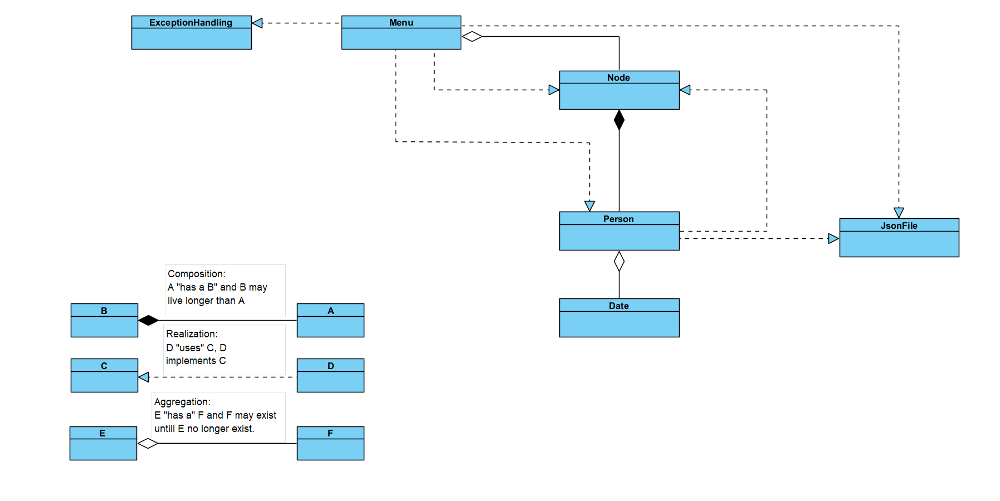
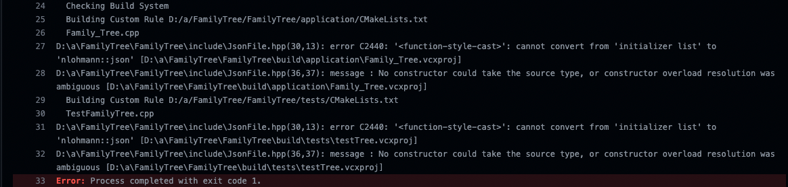
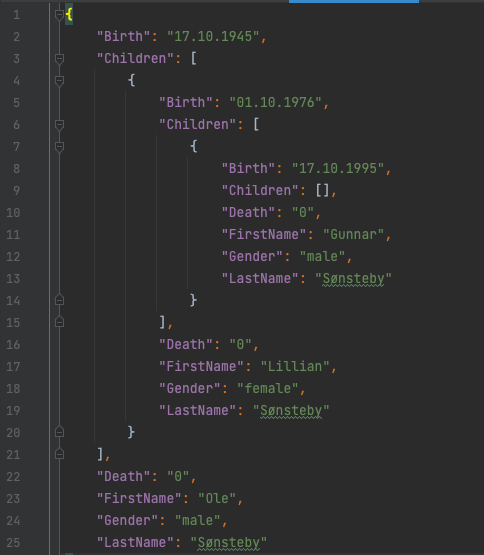

# FamilyTree

## General information

This is a school project created by students at NTNU Ålesund. \
Institusjonsnummer: 194 \
Emnekode: AIS1002_1 \
Emnetittel: Objektorientert programmering og algoritmer \
Eksamenstype: Mappevurdering \
GruppeNr: 18 \
KandidatNr: 10025 \
KanditatNr: 10026

## Table of contents

- [Classes](#classes)
- [Documentation](#documentation)
- [Assumptions](#assumptions)
- [Known bugs](#known-bugs)
- [Our solution](#our-solution)
- [Tests](#tests)
- [Future TODOs](#future-todos)
- [Big O](#big-o)
- [References](#references)

##Coding convention
Coding convention Standardized: camelCase \
Variable names camelCase \
Class names PascalCase \
Object names camelCase \
Private member variables _camelCase (dash with camelCase)

## Classes

### UML Schematics



## Documentation

The code documentation style is written in the following format:

/// @what: Describing what the function does. \
/// @bigO: Included where it is relevant to mathematically describe the limits of the functions. \
/// @param: Describes the parameters the function takes.\
/// @returns: Describes the return value of the function.\
/// @usage: Describes where the function has been used in this project.\
/// @example: Show an example of how the function can be implemented.

## Assumptions

### We have made the following assumptions for our program:

    - Every name is unique
    - No more than one person is emptied at the time
        - Tree structure will chose first person with correlating name when traversing
        - To fill, every attribute can be edited
    - We have taken it one step further by making a general tree and this will satisfy the task
    - Special characters such as æ, ø, å is to be avoided.



## Known bugs

- Birth and death limits have not been implemented.
    - This allows the user to get negative ages and set both birth and death in the future.
    - Program will also print the age even though the person is dead. -This program continuously fails on githubs
      windows build. All other windows computers we have tried runs the program fine.
    - The program builds on Linux and MacOS exceptionally.
    - The bug is because of the .json library we have relied upon.

## Our solution

### General tree

We have made a general tree. This means that it is preferable to start with your ancestor. \
Pros:

- Each node can have as many children as desired.
- This code can become a binary tree if the children vector is limited to two elements.
- In this program each node can see both ways.
- More types of traversals possible \

Cons:

- Requires more data per node than a binary tree.
- Not very suitable to chose yourself for root node.

### Traversal

- We have chosen to focus on the depth first traversal
- We have not yet implemented breadth first traversal. We have made a working upwards traversal though.

## Tests

### Improvements

- Corner cases of persons, nodes, traversal and filewriting being tested.
- There could have been more tests testing even smaller corner cases.

## Future TODOs

### Gender

Persons gender value should be of type enum and not string. \
It was previously made string because of convenience of all attributes being string. \
This is a priority for future versions.

### GUI

In the future we would prefer to implement a GUI with QT cpp library. This could also be done with python. This is not
prioritized as of now.

### Traversal

Implementation of breadth first traversal is prioritized to be implemented.

### Remove person function

Implement that if user wants to delete a node and node is a leaf it will be removed from the parents vector

### Remove private variables from Date class

Make functions return the right values instead.

## Big O

Both depth first and upwards traversal algorithms have been included in Node.hpp. \
The big O notation for both of these traversal algorithms are O(n). \
This is because it requires the function to visit once per node in the worst case.

## Notable code explanation

### Depth traversal with editing

Uses the traverseDepth function for traversal. \
This traversal algorithm utilizes a lambda function to edit person after traversal has found person. \
Lambda is executed if person is found. \
Feedback from function werther person is found.

```cpp
void traverseDepthSearch(std::shared_ptr<Node<T>> root, std::string &firstName, std::string &lastName, std::function<void(T &)> editingFunc) {
    bool personFound = false;
    root->traverseDepth([ firstName, lastName, editingFunc, &personFound ](Node<T> &node) {
      if (node.getPerson().getFirstName() == firstName && node.getPerson().getLastName() == lastName) {
        personFound = true;
        std::cout << node << " was found and operation has successfully been executed." << std::endl << std::endl;
        auto &myPerson = node.getPerson();
        editingFunc(myPerson);
      }
    });
    if (!personFound) {
      std::cout << firstName << " " << lastName << " could not be found in tree." << std::endl;
    }
  }
```

### Example of saved jsonFile

Json is being saved and retrieved in a tree pattern \


###Writing tree to json
First overloaded function catches template exceptions. \
Second function is recursive as it calls the getChildren() at "Children"
```cpp
namespace nlohmann {
  template<class T>
  void to_json(json &j, std::shared_ptr<Node<T>> n) {
    throw std::runtime_error("Unknown type T");
  };
  
  void to_json(json &j, std::shared_ptr<Node<Person>> n) {
    Person p = n->getPerson();
    j = json{
      {"FirstName", p.getFirstName()},
      {"LastName", p.getLastName()},
      {"Birth", p.getBirth()},
      {"Death", p.getDeath()},
      {"Gender", p.getGender()},
      {"Children", n->getChildren()}};
  }
}// Namespace nlohmann
```

###Reading tree from json
This function was hard to work out. \
This recursively calls itself traversing the tree while adding relation to previous node.
If the rootnode from parameter is empty it creates the first person. \
For each childnode the function adds it to the parent.
```cpp
std::shared_ptr<Node<Person>> nodeFromJson(nlohmann::json &j, std::shared_ptr<Node<Person>> rootNode) {
    Person person;
    if (rootNode->isEmpty()) {
      person = personFromJson(j);
      rootNode = std::make_shared<Node<Person>>(person);
    }
    if (j.contains("Children") && !j.at("Children").empty()) {
      for (auto jsonChildNode: j.at("Children")) {
        if (j.contains("FirstName")) {
          _parentFirstName = j.at("FirstName");
        }
        if (j.contains("LastName")) {
          _parentLastName = j.at("LastName");
        }
        person = personFromJson(jsonChildNode);
        auto lambda = [ person ](Node<Person> &node) {
          node.add(person);
        };
        rootNode->traverseDepth(lambda, _parentFirstName, _parentLastName);
        nodeFromJson(jsonChildNode, rootNode);
      }
    }
    _rootNode = rootNode;
    return rootNode;
  }
```

## References

### In Node.hpp

We started off the project getting inspiration from "Folders" written by Lars Ivar Hatledal \
Link: https://github.com/AIS1002-OOP/folders/blob/master/main.cpp \
Date of information: (05.05.2022).\
Justification: As we learned Object oriented programming this was a good place to start our journey. It inspired our
traversal algorithms.

### In json.hpp

Json file handling library Nhlohmannjson.hpp \
Link: https://github.com/nlohmann/json \
Date of information: (20.04.2022) \
Justification: This library really helped write and read json to file. Library is recognized for .json file handling.

### In config.yml

Macos - github build (conan-on-darwin) \
Link: https://github.com/markaren/threepp/blob/master/.github/workflows/config.yml \
Date of information: (20.04.2022) \
Justification: This helped building our program on MacOs on github.

### In ExceptionHandling.hpp

Inspiration for checking integer input (checkStateInput function) \
Link: https://stackoverflow.com/questions/19696442/how-to-catch-invalid-input-in-c \
Date of information:(26.04.2022) \
Justification: This helped us implement a neat way to get the right user input for integers.

### In Date.hpp

Inspiration for date class \
Link: http://gauss.ececs.uc.edu/Courses/C321/html/date.html \
Date of information: (03.05.2022) \
Justification: Date and age calculation is not that simple. This page helped form the logic behind the date class.

### In Date.hpp

Inspiration for splitting date string (setDate function) \
Link: https://stackoverflow.com/questions/14265581/parse-split-a-string-in-c-using-string-delimiter-standard-c \
Date of information: (03.05.2022) \
Justification: This helped us split the date strings in the right places in order to convert to integers.

### In Date.hpp

Inspiration for age calculation (calculateAge function) \
Link: https://www.codespeedy.com/calculate-age-from-date-of-birth-in-cpp/ \
Date of information: (03.05.2022) \
Justification: Helped creating the logic for calculating the age of person.

### In JsonFile.hpp

Checking for empty file (isEmpty function) \
Link: https://tousu.in/qa/?qa=486809/ \
Date of information: (19.05.2022) \
Justification: This is a neat way to check werther the file is empty.

### In Date.hpp

Time tracking (getCurrentDate function) \
Link: https://www.tutorialspoint.com/cplusplus/cpp_date_time.htm \
Date of information: (16.05.2022) \
Justification: This helped us get the current date in a neat date.